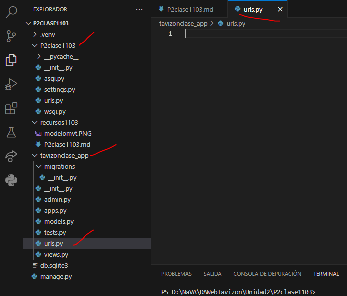
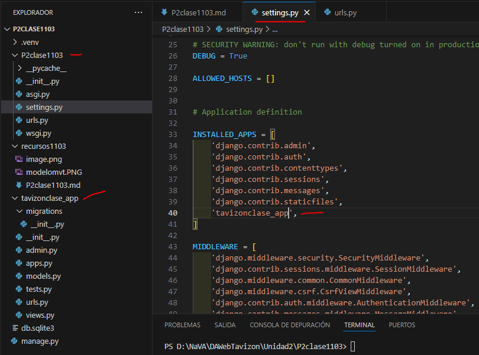
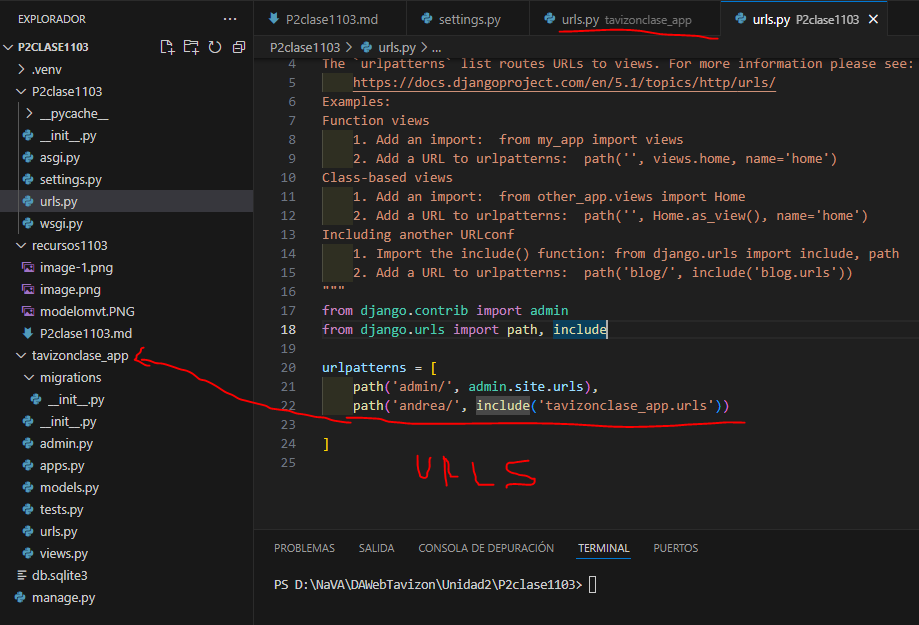
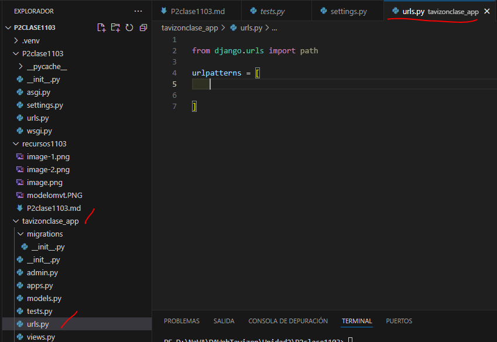
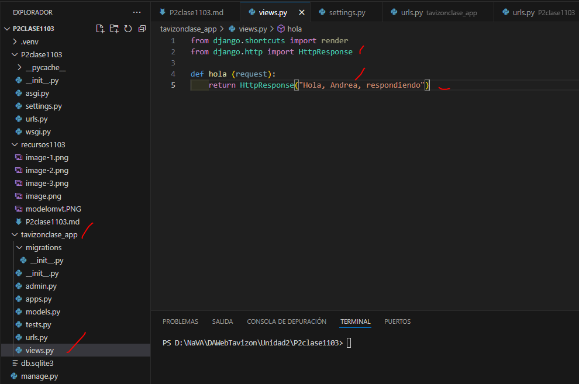
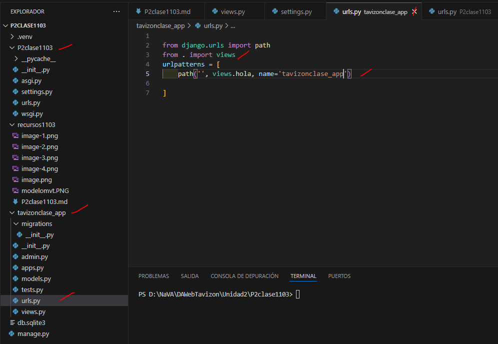

- Crear aplicacion tavizonclase_app
- Comando --> python manage.py startapp tavizonclase_app
- Creamos el archivo urls.py en tavizonclase_app
- 
- En setting.py de P2clase1103
- 
-  En urls.py de P2clase1103
- 
- En views.py en tavizon_app 
- 
- En urls.py P2clase1103
- 
- En urls.py tavizonclasse_app
- 